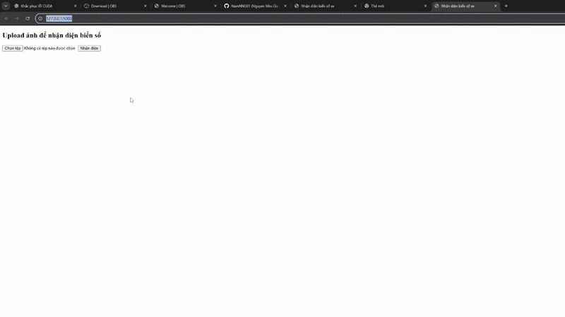

# ObjectDetection-Nhan_dien_bien_so_xe
This project applies Object Detection techniques to detect and extract vehicle license plates from images. It can be used in traffic surveillance systems, smart parking lots, and vehicle access control solutions.

   
  <i>Example output of YOLOv8 detecting license plates.</i>

**Features**
- Detects the position of license plates in images or video frames.
- Crops and extracts the plate region.
  
**Technologies Used**
- Python
- OpenCV
- YOLOv8
- PyTorch
- Label Studio

**How to Use**
- Train the model using your custom dataset for 50 epochs on GPU 0:
  
    results = model.train(data="my_data.yaml", epochs=50, device='0', batch = 32, imgsz = 416)  # change to your "my_data.yaml" path
  
- Predict the result:
  
  results = model.predict(r"E:\Project\Object_Detection_Biensoxe\a.png", imgsz=416)

- Change the image on web to detect

